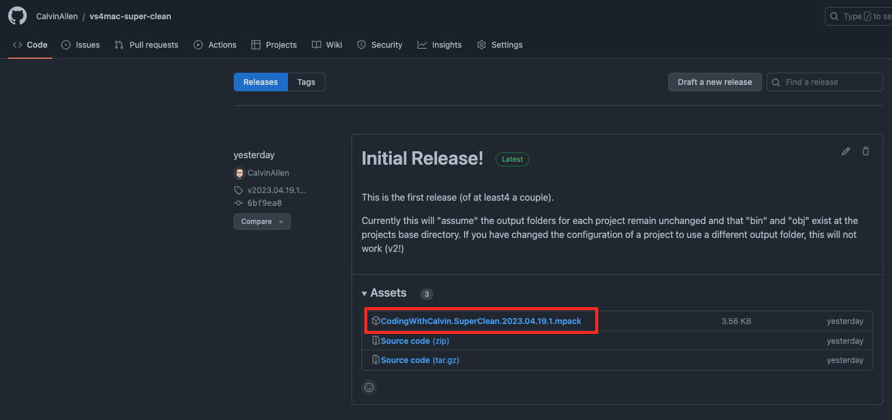
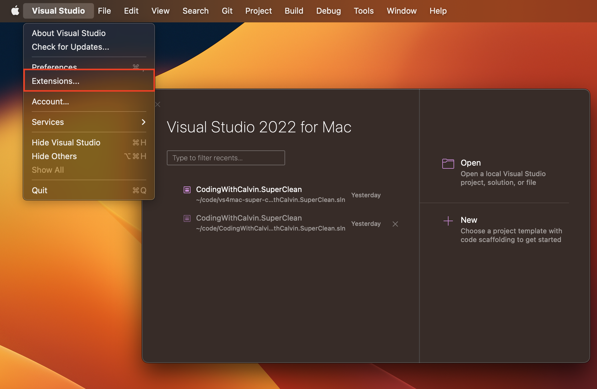
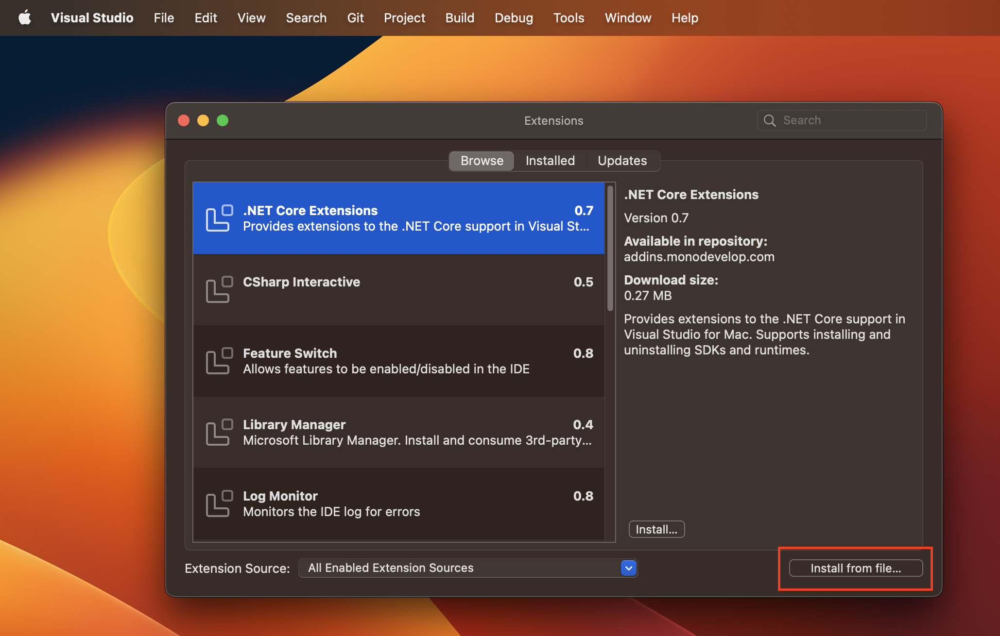
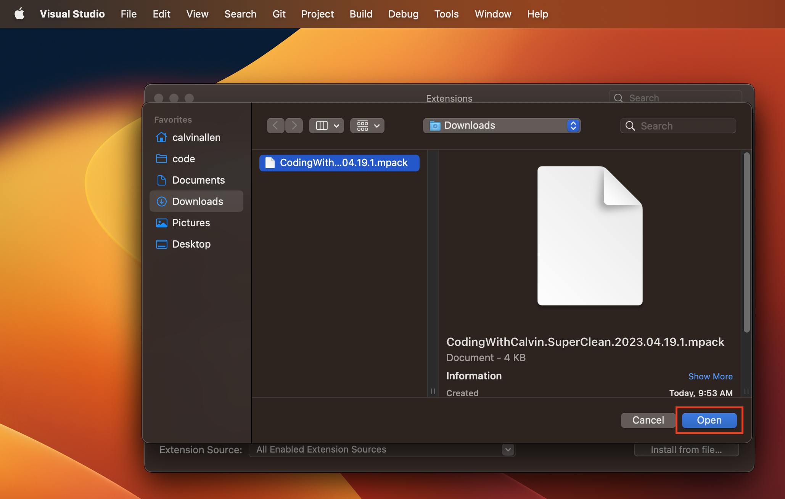
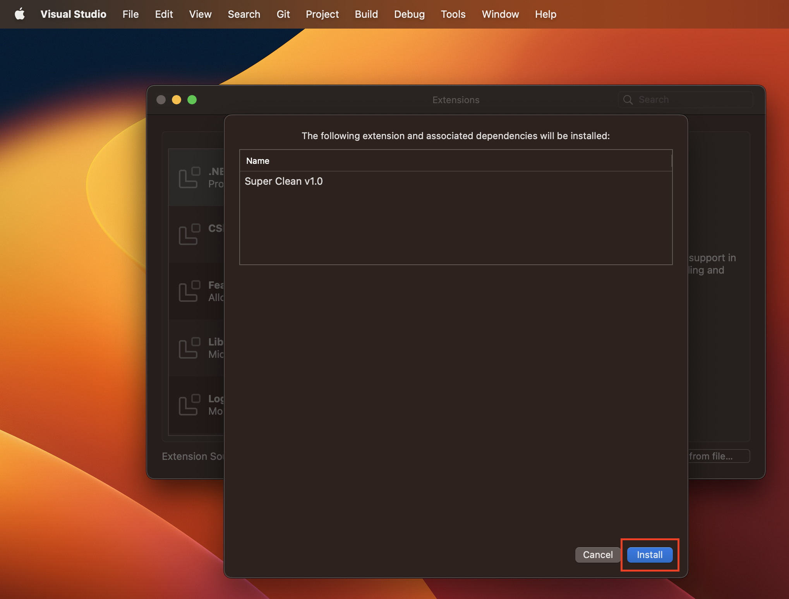
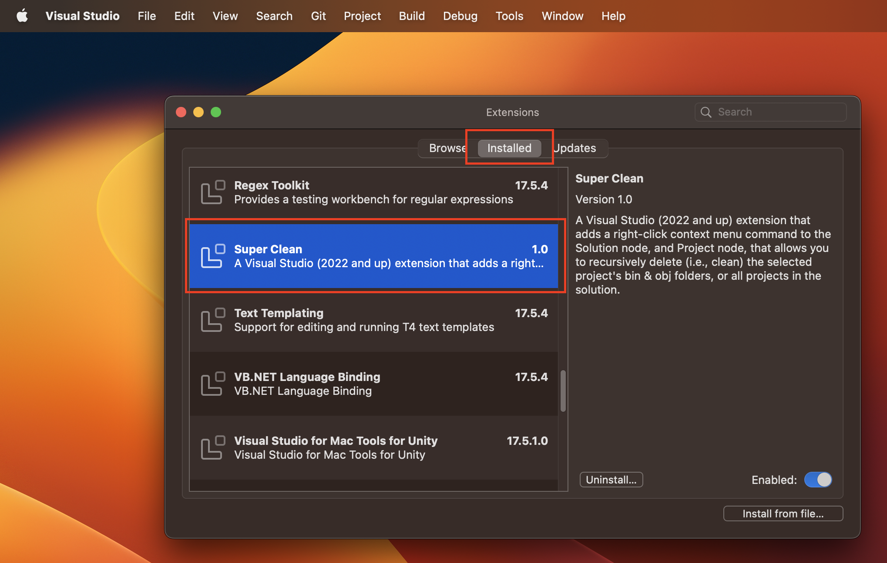

# Super Clean - VS4Mac 2022 Edition

Super Clean is an extension for Visual Studio for Mac that, when triggered, completely obiterates the bin and obj directories from all projects in the solution

## License

## Build Status

## Installation

Until this extension can be made available through public extension source channels, you will need to install it manually.

1. Download the `*.mpack` file from the [most recent release here on the GitHub repository](https://github.com/CodingWithCalvin/vs4mac-superclean/releases) to your Mac
   i. 
2. From within Visual Studio for Mac, open the 'Extensions' dialog from the main menu
   i. 
3. On the Extensions dialog, click, "Install from File"
   i 
4. From the standard file picker, navigate to where you downloaded the `*.mpack` file in step #1 and open it
   i 
5. On the dialog that appears, telling you which extension will be installed, validate the information and click "Install"
   i. 
6. When the install dialog closes and brings you back to the Extensions dialog, click the "Installed" tab and verify you see Super Clean in the list of installed extensions.
   i. 

Enjoy!

## Contributions

Contributions are welcome! Issues, PRs, etc. While it may seem this extension is "done", who knows what the future may hold for it?
